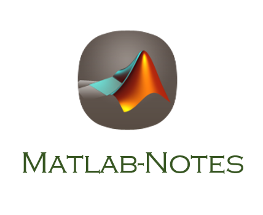

<div align="center">
    
    <br>
    <a href="xx"> -read-4ab8a1.svg"></a>  <a href="https://github.com/thu-zhanghl"> </a> 
    <br> <br>
</div> 

## 目录
## :bread: 基础

- #### Matlab 基础教程
	- [MATLAB 快速入门（官网）](https://ww2.mathworks.cn/help/matlab/getting-started-with-matlab.html) [PDF英文版本](assets/getstart.pdf)
	- [语言基础知识——语法、运算符、数据类型、数组索引及处理（官网）](https://ww2.mathworks.cn/help/matlab/language-fundamentals.html) 
	- [图形——二维和三维绘图、图像、动画、可视化（官网）](https://ww2.mathworks.cn/help/matlab/graphics.html)
	- [数据导入和分析——导入和导出、预处理、可视化探查（官网）](https://ww2.mathworks.cn/help/matlab/data-import-and-analysis.html)
```language
注：
    Matlab 基础部分只需要利用好官网的教程，把上面 4部分内容过一遍即可。
```

- #### Matlab 编程
	- [脚本和函数编程——程序文件、控制流、编辑、调试（官网）](https://ww2.mathworks.cn/help/matlab/programming-and-data-types.html)
	- [《Matlab 编程》第二版 Stephen J. Chapman 著 邢树军 郑碧波译](assets/Matlab编程(第二版).pdf)

	
```
注：
    Matlab 脚本和函数编程除了官方教程外，推荐一本《Matlab编程》第二版，里面有大量的指导和练习，有助于养成良好的代码习惯。
```	


## 💻 进阶
- ####
- ####

- #### Effective Matlab — 编写高效的 Matlab 代码

## 📏 应用
- #### Matlab 科学计算


### :memo: 后记 

### License
<a rel="license" href="http://creativecommons.org/licenses/by-nc-nd/4.0/"></a><br />本作品采用<a rel="license" href="http://creativecommons.org/licenses/by-nc-nd/4.0/">知识共享署名-非商业性使用-禁止演绎 4.0 国际许可协议</a>进行许可。